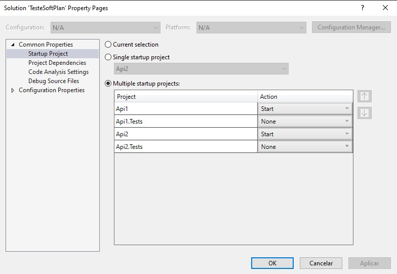

# Teste SoftPlan

O projeto tem como objetivo calcular o valor do juro composto utilizando duas Apis.

## Clonar o projeto

```bash
    git clone https://github.com/raulmesteves94/TesteSoftPlan 
```
## Execução Local

Com a solução aberta no Visual Studio, clicar com o botão direito no solution, selecionar Propriedades e marcar a opção de multiplos projetos:



## Execução Local - Docker

Com o Docker instalado, acessar a pasta docker na raiz da aplicação e executar o seguinte comando no terminal:

```bash
    docker-compose up -d
```
Validar se as imagens api1 e api2 estão sendo executadas. As Apis estarão disponíveis nas portas 5000 e 7000.
